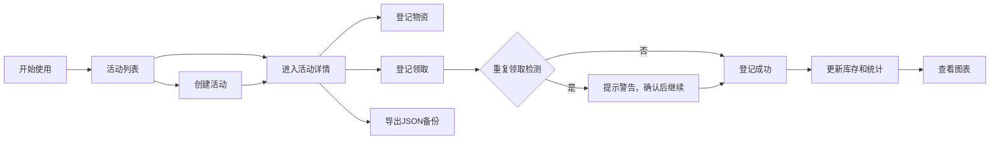

## 1. 产品概述

二次元应援物资管理工具，专为虚拟主播/企划应援组设计，用于离线整理和管理各类应援物资。工具支持活动创建、物资登记、库存管理、领取记录追踪和数据可视化，所有数据保存在浏览器本地，无需联网即可使用。

## 2. 核心功能

### 2.1 用户角色
| 角色 | 注册方式 | 核心权限 |
|------|----------|----------|
| 应援组管理员 | 无需注册，本地使用 | 创建活动、管理物资、登记领取、导出备份 |

### 2.2 功能模块
1. **活动管理**：活动列表、创建活动、编辑活动、删除活动
2. **物资管理**：物资登记（灯牌、手幅、贴纸、无料包、抽选礼物等）、库存管理、设计稿链接、预算、供应商、发放规则配置
3. **领取管理**：领取登记、领取记录、重复领取提示、领取人信息
4. **数据统计**：活动维度库存统计、物资消耗图表、预算使用情况
5. **数据管理**：本地存储、JSON导出备份、JSON导入恢复

### 2.3 页面详情
| 页面名称 | 模块名称 | 功能描述 |
|---------|----------|----------|
| 活动列表页 | 活动卡片列表 | 展示所有活动概览，支持搜索筛选，快速进入活动详情 |
| 活动详情页 | 物资统计面板 | 展示活动总物资、已发放、剩余库存统计卡片 |
| 活动详情页 | 物资列表 | 展示活动下所有物资的详细信息和库存状态 |
| 活动详情页 | 消耗图表 | 物资消耗趋势柱状图、物资类型占比饼图 |
| 活动详情页 | 领取记录 | 按时间排序的领取记录列表，支持筛选 |
| 活动详情页 | 领取登记 | 快速登记领取，自动检测重复领取并提示 |
| 物资编辑弹窗 | 物资表单 | 登记/编辑物资：名称、类型、设计稿链接、预算、供应商、库存、发放规则 |
| 数据管理页 | 导入导出 | JSON备份导出、从JSON文件恢复数据、清空数据 |

## 3. 核心流程

用户打开工具 → 查看活动列表 → 创建新活动或进入已有活动 → 登记物资信息 → 活动进行中登记领取 → 系统自动检测重复领取 → 查看实时库存和消耗图表 → 活动结束后导出JSON备份

## 4. 用户界面设计

### 4.1 设计风格
- **主色调**：樱花粉 `#FFB6C1` 作为主色，薰衣草紫 `#E6E6FA` 作为辅助色，搭配白色和浅灰
- **按钮风格**：圆润柔和，带有轻微渐变和阴影，hover时有缩放动效
- **字体**：使用圆润可爱的中文字体，标题使用稍粗字重，正文清晰易读
- **布局风格**：卡片式布局，圆角边框，柔和阴影，充足留白
- **图标/emoji**：使用可爱风格的Lucide图标，适当加入emoji增强二次元氛围

### 4.2 页面设计概述
| 页面名称 | 模块名称 | UI Elements |
|---------|----------|-------------|
| 活动列表页 | 顶部导航 | Logo、数据管理入口、新活动按钮 |
| 活动列表页 | 活动卡片 | 活动封面、名称、日期、物资数量统计、状态标签 |
| 活动详情页 | 统计面板 | 四个彩色统计卡片，带图标和数字动画 |
| 活动详情页 | 标签切换 | 物资列表、领取记录、数据图表三个标签页 |
| 活动详情页 | 物资列表 | 带物资类型图标的卡片列表，显示库存进度条 |
| 活动详情页 | 领取登记 | 浮动快捷按钮，弹出登记表单 |
| 物资编辑弹窗 | 表单 | 分组表单，物资类型选择器，日期选择器 |
| 数据管理页 | 操作区 | 导入、导出、清空三个大按钮，带确认对话框 |

### 4.3 响应性
- 桌面端优先设计，采用1200px以上优化布局
- 自适应平板和移动设备，小屏幕下切换为单列布局
- 触摸操作优化，按钮最小高度44px

### 4.4 动效设计
- 页面加载时元素渐入，带轻微延迟的错落动画
- 数据更新时数字滚动动画
- 卡片hover时轻微上浮和阴影加深
- 模态框弹出时弹性缩放动画
- 库存变化时进度条平滑过渡
