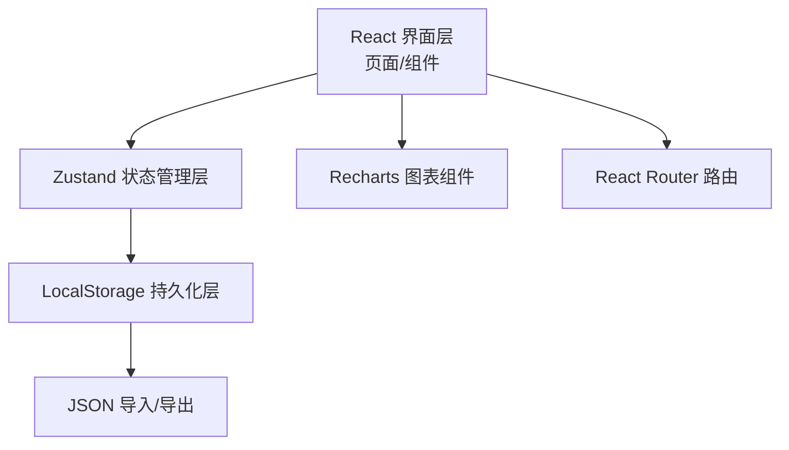
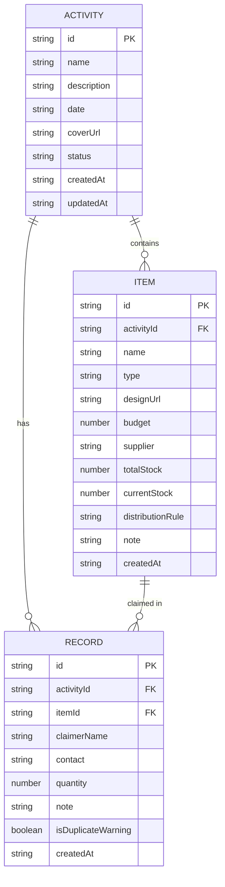

## 1. 架构设计



## 2. 技术描述
- **前端框架**：React@18 + TypeScript + Vite
- **路由管理**：react-router-dom@6
- **状态管理**：zustand@4（结合 persist 中间件实现 LocalStorage 持久化）
- **UI样式**：tailwindcss@3
- **图标库**：lucide-react
- **图表库**：recharts@2（柱状图、饼图、折线图）
- **表单处理**：原生 React 受控表单
- **数据存储**：浏览器 localStorage
- **包管理器**：npm（macOS环境）

## 3. 路由定义
| Route | 页面用途 |
|-------|----------|
| `/` | 活动列表首页 |
| `/activity/:id` | 活动详情页（物资、领取、图表） |
| `/data` | 数据管理页（导入导出） |

## 4. 数据模型

### 4.1 数据模型定义



### 4.2 TypeScript 类型定义

```typescript
type ItemType = 'lightstick' | 'banner' | 'sticker' | 'freepack' | 'lottery' | 'other';

interface Activity {
  id: string;
  name: string;
  description: string;
  date: string;
  coverUrl: string;
  status: 'upcoming' | 'ongoing' | 'completed';
  createdAt: string;
  updatedAt: string;
}

interface Item {
  id: string;
  activityId: string;
  name: string;
  type: ItemType;
  designUrl: string;
  budget: number;
  supplier: string;
  totalStock: number;
  currentStock: number;
  distributionRule: string;
  note: string;
  createdAt: string;
}

interface ClaimRecord {
  id: string;
  activityId: string;
  itemId: string;
  claimerName: string;
  contact: string;
  quantity: number;
  note: string;
  isDuplicateWarning: boolean;
  createdAt: string;
}

interface AppData {
  activities: Activity[];
  items: Item[];
  records: ClaimRecord[];
}
```

## 5. 状态管理设计

### Zustand Store 结构

```typescript
interface AppState {
  activities: Activity[];
  items: Item[];
  records: ClaimRecord[];
  
  // Activity actions
  addActivity: (data: Omit<Activity, 'id' | 'createdAt' | 'updatedAt'>) => void;
  updateActivity: (id: string, data: Partial<Activity>) => void;
  deleteActivity: (id: string) => void;
  
  // Item actions
  addItem: (data: Omit<Item, 'id' | 'createdAt'>) => void;
  updateItem: (id: string, data: Partial<Item>) => void;
  deleteItem: (id: string) => void;
  
  // Record actions
  addRecord: (data: Omit<ClaimRecord, 'id' | 'createdAt' | 'isDuplicateWarning'>) => { 
    success: boolean; 
    isDuplicate: boolean;
    record?: ClaimRecord;
  };
  deleteRecord: (id: string) => void;
  
  // Data actions
  exportData: () => string;
  importData: (data: AppData) => { success: boolean; error?: string };
  clearAllData: () => void;
  
  // Helper actions
  checkDuplicateClaim: (activityId: string, itemId: string, claimerName: string) => boolean;
  getActivityStats: (activityId: string) => ActivityStats;
  getItemConsumptionData: (activityId: string) => ConsumptionData[];
}
```

## 6. 组件结构

```
src/
├── components/
│   ├── ActivityCard.tsx      # 活动卡片组件
│   ├── ActivityForm.tsx      # 活动表单弹窗
│   ├── ItemCard.tsx          # 物资卡片组件
│   ├── ItemForm.tsx          # 物资表单弹窗
│   ├── ClaimForm.tsx         # 领取登记弹窗
│   ├── ClaimRecordItem.tsx   # 领取记录条目
│   ├── StatsCard.tsx         # 统计卡片
│   ├── ConsumptionChart.tsx  # 消耗趋势图表
│   ├── TypeDistributionChart.tsx  # 类型分布图
│   ├── Modal.tsx             # 通用弹窗组件
│   └── Navbar.tsx            # 顶部导航
├── pages/
│   ├── ActivityList.tsx      # 活动列表页
│   ├── ActivityDetail.tsx    # 活动详情页
│   └── DataManagement.tsx    # 数据管理页
├── store/
│   └── useAppStore.ts        # Zustand状态管理
├── types/
│   └── index.ts              # TypeScript类型定义
├── utils/
│   ├── storage.ts            # LocalStorage工具
│   └── helpers.ts            # 通用辅助函数
├── App.tsx
├── main.tsx
└── index.css
```

## 7. 核心功能实现要点

1. **重复领取检测**：领取登记时，根据活动ID、物资ID和领取人姓名，查询领取记录进行比对，若存在则弹出警告提示。

2. **库存管理**：每次成功登记领取后，自动扣减对应物资的当前库存；删除领取记录时自动回滚库存。

3. **数据持久化**：使用 zustand persist 中间件，自动将状态同步到 localStorage；页面刷新时自动恢复。

4. **JSON导出**：将完整数据序列化为格式化JSON字符串，触发浏览器下载，文件名包含时间戳。

5. **JSON导入**：读取用户选择的JSON文件，校验数据格式后覆盖现有数据，导入前提示确认。

6. **图表数据**：根据领取记录按日期聚合生成消耗趋势数据；按物资类型聚合生成占比数据。
